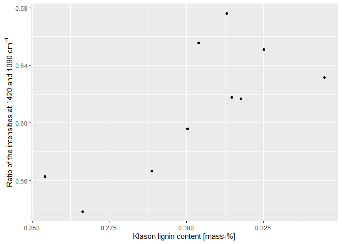

<!-- README.md is generated from README.Rmd. Please edit that file -->
irpeat
======

irpeat is an R package that contains simple functions to analyse infrared spectra of peat samples. Some functions may also work with organic matter samples in general.

Provided functions for analysing infrared spectra of peat are:

1.  Computation of several humification indices.
2.  Klason lignin mass fraction (following Hodgkins et al. (2018)).
3.  Holocellulose mass fraction (following Hodgkins et al. (2018)).

### How to install

You can install irpeat from GitHub using R via:

``` r
remotes::install_github(repo = "henningte/irpeat")
```

irpeat relies on the R package [ir](https://github.com/henningte/ir) for handling infrared spectra.

### How to use

You can load irpeat in R with:

``` r
library(irpeat)

# load additional packages needed for this tutorial
library(ir)
library(ggplot2)
library(magrittr)
```

You can test irpeat with sample data from the R package ir:

``` r
ir::ir_sample_data
#> # A tibble: 58 x 7
#>    measurement_id sample_id sample_type sample_comment klason_lignin
#>  *          <int> <chr>     <chr>       <chr>                  <dbl>
#>  1              1 GN 11-389 needles     Abies Firma M~         0.360
#>  2              2 GN 11-400 needles     Cupressocypar~         0.339
#>  3              3 GN 11-407 needles     Juniperus chi~         0.268
#>  4              4 GN 11-411 needles     Metasequoia g~         0.350
#>  5              5 GN 11-416 needles     Pinus strobus~         0.331
#>  6              6 GN 11-419 needles     Pseudolarix a~         0.279
#>  7              7 GN 11-422 needles     Sequoia sempe~         0.330
#>  8              8 GN 11-423 needles     Taxodium dist~         0.357
#>  9              9 GN 11-428 needles     Thuja occiden~         0.369
#> 10             10 GN 11-434 needles     Tsuga carolin~         0.289
#> # ... with 48 more rows, and 2 more variables: holocellulose <dbl>,
#> #   spectra <list>
```

`ir::ir_sample_data` contains various ATR-MIR spectra of organic reference material (e.g. newspaper, wood, grass).

A simple workflow could be, for example, to baseline correct the spectra (using functions of the package ir) compute various humification indices and Klason lignin and holocellulose mass fractions in the samples. We use only the first few spectra from `ir::ir_sample_data` to speed the computations a bit up.

``` r
x <- 
  ir::ir_sample_data[1:10, ] %>%                                # data
  ir::ir_bc(method = "rubberband") %>%                          # baseline correction
  irpeat::irp_hi() %>%                                          # humification indices
  irpeat::irp_content(variable = c("klason_lignin_hodgkins",    # Klason lignin and
                                   "holocellulose_hodgkins"))   # holocellulose content
```

`x` is identical to `ir::ir_sample_data[1:10, ]`, but contains additional columns for the computed humification indices (h1, h2, h3, h4) and the computed Klason lignin content (klason\_lignin\_hodgkins) and holocellulose content (holocellulose\_hodgkins).

``` r
x
#> # A tibble: 10 x 13
#>    measurement_id sample_id sample_type sample_comment klason_lignin
#>             <int> <chr>     <chr>       <chr>                  <dbl>
#>  1              1 GN 11-389 needles     Abies Firma M~         0.360
#>  2              2 GN 11-400 needles     Cupressocypar~         0.339
#>  3              3 GN 11-407 needles     Juniperus chi~         0.268
#>  4              4 GN 11-411 needles     Metasequoia g~         0.350
#>  5              5 GN 11-416 needles     Pinus strobus~         0.331
#>  6              6 GN 11-419 needles     Pseudolarix a~         0.279
#>  7              7 GN 11-422 needles     Sequoia sempe~         0.330
#>  8              8 GN 11-423 needles     Taxodium dist~         0.357
#>  9              9 GN 11-428 needles     Thuja occiden~         0.369
#> 10             10 GN 11-434 needles     Tsuga carolin~         0.289
#> # ... with 8 more variables: holocellulose <dbl>, spectra <named list>,
#> #   hi1 <dbl>, hi2 <dbl>, hi3 <dbl>, hi4 <dbl>,
#> #   holocellulose_hodgkins <quantits>, klason_lignin_hodgkins <quantits>
```

Plot of the humification index (ratio of the intensities at 1420 and 1090 cm<sup>-1</sup> (Broder et al. 2012)) versus the Klason lignin content:

``` r
ggplot2::ggplot(x, aes(x = quantities::drop_quantities(klason_lignin_hodgkins) * 100, y = hi1)) + 
  ggplot2::geom_point() +
  ggplot2::labs(x = "Klason lignin content [mass-%]", 
                y = expression("Ratio of the intensities at"~1420~and~1090~cm^{-1}))
```



All computed quantities come with units and standard errors (thanks to the [quantities](https://github.com/r-quantities/quantities) package):

``` r
x$holocellulose_hodgkins
#> Units: [1]
#> Errors: 0.02034155 0.01827250 0.01411164 0.01735219 0.01465642 ...
#>  [1] 0.2079986 0.2458115 0.3347145 0.2635220 0.3212075 0.2866602 0.2290746
#>  [8] 0.2094640 0.2964282 0.2998223
x$klason_lignin_hodgkins
#> Units: [1]
#> Errors: 0.009226441 0.013044535 0.008079990 0.010003568 0.008940154 ...
#>  [1] 0.3039663 0.3446851 0.2888067 0.3130406 0.3004306 0.2663081 0.3177061
#>  [8] 0.3251141 0.3147190 0.2541749
```

### How to cite

Please cite this R package as:

> Henning Teickner, Suzanne B. Hodgkins (2020). *irpeat: Simple Functions to Analyse Mid Infrared Spectra of Peat Samples*. Accessed 23 Mrz 2020. Online at <https://github.com/henningte/irpeat>.

### Licenses

**Text and figures :** [CC-BY-4.0](http://creativecommons.org/licenses/by/4.0/)

**Code :** See the [DESCRIPTION](DESCRIPTION) file

**Data :** [CC BY 4.0](https://creativecommons.org/licenses/by/4.0/) attribution requested in reuse. See the sources section for data sources and how to give credit to the original author(s) and the source.

### Contributions

We welcome contributions from everyone. Before you get started, please see our [contributor guidelines](CONTRIBUTING.md). Please note that this project is released with a [Contributor Code of Conduct](CONDUCT.md). By participating in this project you agree to abide by its terms.

### Sources

The complete data in this package is derived from Hodgkins et al. (2018) and was restructured to match the requirements of ir. The original article containing the data can be downloaded from <https://www.nature.com/articles/s41467-018-06050-2> and is distributed under the Creative Commons Attribution 4.0 International License (<http://creativecommons.org/licenses/by/4.0/>). The data on Klason lignin and holocellulose content was originally derived from De La Cruz, Florentino B., Osborne, and Barlaz (2016).

This packages was developed in R (R version 3.5.3 (2019-03-11)) (R Core Team 2019) using functions from devtools (Wickham, Hester, and Chang 2019), usethis (Wickham and Bryan 2019), rrtools (Marwick 2019) and roxygen2 (Wickham et al. 2019).

### References

Broder, T., C. Blodau, H. Biester, and K. H. Knorr. 2012. “Peat decomposition records in three pristine ombrotrophic bogs in southern Patagonia.” *Biogeosciences* 9 (4): 1479–91. doi:[10.5194/bg-9-1479-2012](https://doi.org/10.5194/bg-9-1479-2012).

De La Cruz, Florentino B., Jason Osborne, and Morton A. Barlaz. 2016. “Determination of Sources of Organic Matter in Solid Waste by Analysis of Phenolic Copper Oxide Oxidation Products of Lignin.” *Journal of Environmental Engineering* 142 (2): 04015076. doi:[10.1061/(ASCE)EE.1943-7870.0001038](https://doi.org/10.1061/(ASCE)EE.1943-7870.0001038).

Hodgkins, Suzanne B., Curtis J. Richardson, René Dommain, Hongjun Wang, Paul H. Glaser, Brittany Verbeke, B. Rose Winkler, et al. 2018. “Tropical peatland carbon storage linked to global latitudinal trends in peat recalcitrance.” *Nature communications* 9 (1): 3640. doi:[10.1038/s41467-018-06050-2](https://doi.org/10.1038/s41467-018-06050-2).

Marwick, Ben. 2019. “rrtools: Creates a Reproducible Research Compendium.” <https://github.com/benmarwick/rrtools>.

R Core Team. 2019. “R: A Language and Environment for Statistical Computing.” Vienna, Austria: R Foundation for Statistical Computing. <https://www.R-project.org/>.

Wickham, Hadley, and Jennifer Bryan. 2019. “usethis: Automate Package and Project Setup.” <https://CRAN.R-project.org/package=usethis>.

Wickham, Hadley, Peter Danenberg, Gábor Csárdi, and Manuel Eugster. 2019. “roxygen2: In-Line Documentation for R.” <https://CRAN.R-project.org/package=roxygen2>.

Wickham, Hadley, Jim Hester, and Winston Chang. 2019. “devtools: Tools to Make Developing R Packages Easier.” <https://CRAN.R-project.org/package=devtools>.
