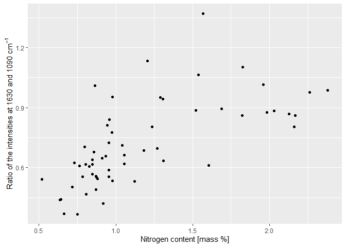

<!-- README.md is generated from README.Rmd. Please edit that file -->

# irpeat 

<!-- badges: start -->

[](https://lifecycle.r-lib.org/articles/stages.html#experimental)
<!-- badges: end -->

## Overview

‘irpeat’ is an R package which contains functions to analyze infrared
spectra of peat samples. These functions are functions to compute
humification indices and functions to predict peat properties. Some
functions may also work with organic matter samples in general.

The following peat properties can be predicted (note model-specific
limitations described in the documentation):

- Elemental contents (C, H, N, O, S, P, K, Ti)
- isotope values
  (C
  and
  N)
- physical properties (bulk density, volume fraction of solids,
  non-macroporosity, macroporosity, saturated hydraulic conductivity,
  specific heat capacity, dry thermal conductivity)
- standard Gibbs free energy of formation
  (G)
- electrochemical properties (electron accepting capacity, electron
  donating capacity)
- microbial nitrogen content (modified version of the model described in
  Reuter et al. (2020))

The package also contains functions to predict holocellulose and Klason
lignin contents (Hodgkins et al. 2018; Teickner and Knorr 2022), but
these models are biased for peat samples (Teickner and Knorr 2022).

### How to install

You can install ‘irpeat’ from GitHub using R via:

``` r
remotes::install_github(repo = "henningte/irpeat")
```

‘irpeat’ relies on the R package [‘ir’](https://github.com/henningte/ir)
for handling infrared spectra.

If you want to use the prediction models, you have to install the
[‘irpeatmodels’](---todo:%20add%20url) package in addition to the
‘irpeat’ package:

``` r
remotes::install_url("---todo:add url", type = "source")
```

### How to use

You can load ‘irpeat’ in R with:

``` r
library(irpeat)

# load additional packages needed for this tutorial
library(ir)
library(irpeatmodels)
library(ggplot2)
library(units)
#> udunits database from C:/Users/henni/AppData/Local/R/win-library/4.2/units/share/udunits/udunits2.xml
```

You can test ‘irpeat’ with sample data from the R package ‘irpeat’:

``` r
irpeat::irpeat_sample_data
#> # A tibble: 59 × 11
#>    id_90 sample_id measurement_id spectra         C      H       N     O       S
#>  * <int>     <int>          <int> <named lis> [g/g]  [g/g]   [g/g] [g/g]   [g/g]
#>  1     1         1             23 <df>        0.479 0.0562 0.00968 0.398 0.00395
#>  2     2         2             32 <df>        0.447 0.0561 0.00478 0.443 0.00008
#>  3     3         3             38 <df>        0.460 0.0560 0.00788 0.412 0.00008
#>  4     5         5             52 <df>        0.471 0.0585 0.00755 0.414 0.00008
#>  5     6         6             54 <df>        0.502 0.0550 0.0127  0.373 0.0013 
#>  6     7         7             55 <df>        0.484 0.0557 0.0091  0.392 0.0012 
#>  7     8         8             56 <df>        0.466 0.0566 0.00725 0.401 0.0008 
#>  8     9         9             57 <df>        0.490 0.0576 0.00885 0.394 0.0013 
#>  9    10        10             24 <df>        0.459 0.0560 0.00838 0.454 0      
#> 10    11        11             25 <df>        0.465 0.0566 0.00723 0.420 0      
#> # … with 49 more rows, and 2 more variables: d15N <dbl>, d13C <dbl>
```

`irpeat_sample_data` contains transmission mid infrared spectra of peat
different samples (See Teickner, Gao, and Knorr (2022) and Teickner,
Gao, and Knorr (2021) for details).

A simple workflow could be, for example, to baseline correct the spectra
(using functions of the package ‘ir’) compute various humification
indices and Klason lignin and holocellulose mass fractions in the
samples. We use only the first few spectra from `ir::ir_sample_data` to
speed the computations a bit up.

``` r
x <- 
  irpeat_sample_data %>%                                  # data
  dplyr::mutate(
    hi_1630_1090 =
      irpeat_sample_data %>%
      ir::ir_bc(method = "rubberband") %>%                # baseline correction
      ir::ir_interpolate(start = NULL, dw = 1) %>%        # interpolation
      irp_hi(x1 = 1630, x2 = 1090) %>%                    # humification index
      dplyr::pull(hi_1630_1090)
  ) %>%
  irpeat::irp_nitrogen_content_1(do_summary = TRUE) %>%   # N content
  irpeat::irp_bulk_density_1(do_summary = TRUE) %>%       # bulk density
  irpeat::irp_macroporosity_1(do_summary = TRUE)          # macroporosity
```

`x` is identical to `irpeat_sample_data`, but contains additional
columns for the computed humification indicex (`h1_1630_1090`) and the
computed nitrogen content (`nitrogen_content_1`)

``` r
x
#> # A tibble: 59 × 18
#>    id_90 sample_id measurement_id          C        H        N        O        S
#>    <int>     <int>          <int> (err) [g/… (err) [… (err) [… (err) [… (err) […
#>  1     1         1             23 0.4790247… 0.05625… 0.00968… 0.39768… 0.00395…
#>  2     2         2             32 0.4468899… 0.0561(… 0.00478… 0.44283…  8(0)e-5
#>  3     3         3             38 0.4599222… 0.05598… 0.00788… 0.41248…  8(0)e-5
#>  4     5         5             52 0.4708597… 0.05853… 0.00755… 0.41433…  8(0)e-5
#>  5     6         6             54 0.5019724… 0.05495… 0.0127(… 0.3732(… 0.0013(…
#>  6     7         7             55 0.4844088… 0.0557(… 0.0091(… 0.39185… 0.0012(…
#>  7     8         8             56 0.4661264… 0.05655… 0.00725… 0.40095…  8(0)e-4
#>  8     9         9             57 0.4897663… 0.05765… 0.00885… 0.39395… 0.0013(…
#>  9    10        10             24 0.4594893… 0.05598… 0.00838… 0.45435…     0(0)
#> 10    11        11             25 0.4647567… 0.05663… 0.00723… 0.42003…     0(0)
#> # … with 49 more rows, and 10 more variables: d15N <dbl>, d13C <dbl>,
#> #   hi_1630_1090 <numeric>, nitrogen_content_1 (err) [g/g],
#> #   nitrogen_content_1_in_pd <logical>, bulk_density_1 (err) [g/cm^3],
#> #   bulk_density_1_in_pd <logical>, spectra <named list>,
#> #   macroporosity_1 (err) [L/L], macroporosity_1_in_pd <logical>
```

Plot of the humification index (ratio of the intensities at 1420 and
1090 cm<sup>-1</sup> (Broder et al. 2012)) versus the Klason lignin
content:

``` r
x %>%
  ggplot(
    aes(
      x = 
        nitrogen_content_1 %>%
        units::set_units(value = "%") %>%
        quantities::drop_quantities(), 
      y = 
        hi_1630_1090
    )
  ) + 
  geom_point() +
  labs(
    x = "Nitrogen content [mass-%]", 
    y = expression("Ratio of the intensities at"~1630~and~1090~cm^{-1})
  )
```

<!-- -->

All computed quantities come with units and standard errors (thanks to
the [quantities](https://github.com/r-quantities/quantities) package):

``` r
x$nitrogen_content_1[1:5]
#> Units: [g/g]
#> Errors: 0.001157014 0.000871431 0.001076665 0.001012812 0.001258238
#>          V1          V2          V3          V4          V5 
#> 0.010407304 0.005570570 0.008703218 0.007687649 0.012470859
```

### Future development

Henning Teickner plans, as part of his PhD project, to extensively
extent ‘irpeat’ by developing a set of calibration models that can
predict various peat physicochemical properties from mid infrared
spectra. These models should be finished by September 2024. Currently, a
data compendium ([pmird](https://henningte.github.io/pmird/index.html))
is developed to collect the data required for this task.

### How to cite

Please cite this R package as:

> Henning Teickner, Suzanne B. Hodgkins (2023). *irpeat: Functions to
> Analyze Mid Infrared Spectra of Peat Samples*. Accessed 2023-03-18.
> Online at <https://github.com/henningte/irpeat>.

### Licenses

**Text and figures :**
[CC-BY-4.0](https://creativecommons.org/licenses/by/4.0/)

**Code :** See the [DESCRIPTION](DESCRIPTION) file

**Data :** [CC BY 4.0](https://creativecommons.org/licenses/by/4.0/)
attribution requested in reuse. See the sources section for data sources
and how to give credit to the original author(s) and the source.

### Contributions

We welcome contributions from everyone. Before you get started, please
see our [contributor guidelines](CONTRIBUTING.md). Please note that this
project is released with a [Contributor Code of Conduct](CONDUCT.md). By
participating in this project you agree to abide by its terms.

### Sources

The data and prediction models for holocellulose and Klason lignin
(`irp_content_h_hodgkins_model`, `irp_content_kl_hodgkins_model`) are
derived from Hodgkins et al. (2018) and were restructured to match the
requirements of ir. The original article containing the data can be
downloaded from <https://www.nature.com/articles/s41467-018-06050-2> and
is distributed under the Creative Commons Attribution 4.0 International
License (<https://creativecommons.org/licenses/by/4.0/>). The data on
Klason lignin and holocellulose content was originally derived from De
la Cruz, Osborne, and Barlaz (2016).

Modified prediction models for holocellulose and Klason lignin
(`model_holocellulose_2`, `model_klason_lignin_2`) are derived from
Teickner and Knorr (2022).

Data and models for the electrochemical accepting and donating
capacities (EAC, EDC) of peat were derived from Teickner, Gao, and Knorr
(2022) and Teickner, Gao, and Knorr (2021)

This packages was developed in R (R version 4.2.0 (2022-04-22 ucrt)) (R
Core Team 2020) using functions from devtools (Wickham et al. 2021),
usethis (Wickham, Bryan, and Barrett 2022), and roxygen2 (Wickham et al.
2022).

### References

<div id="refs" class="references csl-bib-body hanging-indent">

<div id="ref-Broder.2012" class="csl-entry">

Broder, T., C. Blodau, H. Biester, and K. H. Knorr. 2012. “Peat
Decomposition Records in Three Pristine Ombrotrophic Bogs in Southern
Patagonia.” *Biogeosciences* 9 (4): 1479–91.
<https://doi.org/10.5194/bg-9-1479-2012>.

</div>

<div id="ref-DelaCruz.2016" class="csl-entry">

De la Cruz, Florentino B., Jason Osborne, and Morton A. Barlaz. 2016.
“Determination of Sources of Organic Matter in Solid Waste by Analysis
of Phenolic Copper Oxide Oxidation Products of Lignin.” *Journal of
Environmental Engineering* 142 (2): 04015076.
<https://doi.org/10.1061/(ASCE)EE.1943-7870.0001038>.

</div>

<div id="ref-Hodgkins.2018" class="csl-entry">

Hodgkins, Suzanne B., Curtis J. Richardson, René Dommain, Hongjun Wang,
Paul H. Glaser, Brittany Verbeke, B. Rose Winkler, et al. 2018.
“Tropical Peatland Carbon Storage Linked to Global Latitudinal Trends in
Peat Recalcitrance.” *Nature Communications* 9 (1): 3640.
<https://doi.org/10.1038/s41467-018-06050-2>.

</div>

<div id="ref-RCoreTeam.2020" class="csl-entry">

R Core Team. 2020. *R: A Language and Environment for Statistical
Computing*. Manual. Vienna, Austria: R Foundation for Statistical
Computing.

</div>

<div id="ref-Reuter.2020" class="csl-entry">

Reuter, Hendrik, Julia Gensel, Marcus Elvert, and Dominik Zak. 2020.
“Evidence for Preferential Protein Depolymerization in Wetland Soils in
Response to External Nitrogen Availability Provided by a Novel FTIR
Routine.” *Biogeosciences* 17 (2): 499–514.
<https://doi.org/10.5194/bg-17-499-2020>.

</div>

<div id="ref-Teickner.2021c" class="csl-entry">

Teickner, Henning, Chuanyu Gao, and Klaus-Holger Knorr. 2021.
“Reproducible Research Compendium with R Code and Data for:
’Electrochemical Properties of Üeat Particulate Organic Matter on a
Global Scale: Relation to Peat Chemistry and Degree of Decomposition’.”
Zenodo. <https://doi.org/10.5281/zenodo.5792970>.

</div>

<div id="ref-Teickner.2022" class="csl-entry">

———. 2022. “Electrochemical Properties of Peat Particulate Organic
Matter on a Global Scale: Relation to Peat Chemistry and Degree of
Decomposition.” *Global Biogeochemical Cycles* 36 (2): e2021GB007160.
<https://doi.org/10.1029/2021GB007160>.

</div>

<div id="ref-Teickner.2022a" class="csl-entry">

Teickner, Henning, and Klaus-Holger Knorr. 2022. “Improving Models to
Predict Holocellulose and Klason Lignin Contents for Peat Soil Organic
Matter with Mid Infrared Spectra.” Preprint. Soil and methods.
<https://doi.org/10.5194/soil-2022-27>.

</div>

<div id="ref-Wickham.2022" class="csl-entry">

Wickham, Hadley, Jennifer Bryan, and Malcolm Barrett. 2022. “<span
class="nocase">usethis</span>: Automate Package and Project Setup.”

</div>

<div id="ref-Wickham.2022a" class="csl-entry">

Wickham, Hadley, Peter Danenberg, Gábor Csárdi, and Manuel Eugster.
2022. “<span class="nocase">roxygen2</span>: <span
class="nocase">In-line</span> Documentation for R.”

</div>

<div id="ref-Wickham.2021" class="csl-entry">

Wickham, Hadley, Jim Hester, Winston Chang, and Jennifer Bryan. 2021.
“<span class="nocase">devtools</span>: Tools to Make Developing R
Packages Easier.”

</div>

</div>
